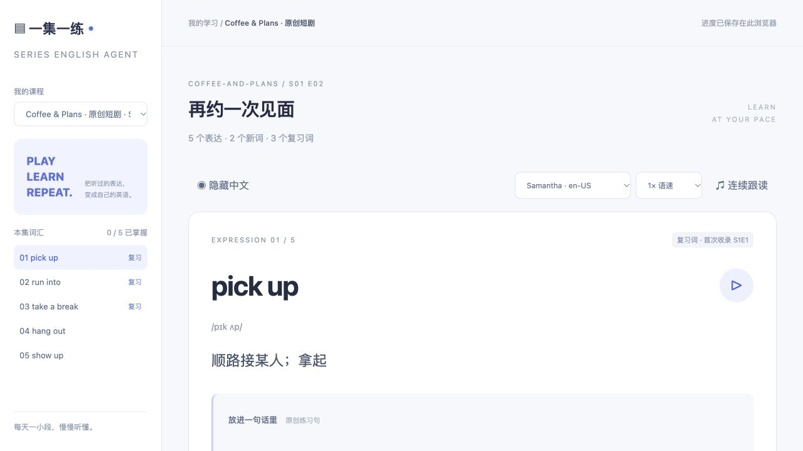

# 一集一练 · Series English Agent

## 下一集，听懂得更多。

**用喜欢的剧，练出用得上的英语。**

告诉 Agent 你准备看哪一集，它会借助 Skill 整理实用表达，配上中文解释、例句和发音练习。先把这些表达听一遍、读一遍，再去看剧，让剧情帮你把它们记住。

看完后，再用几个小练习，把“刚刚听到过”变成“下次我也会用”。

[开始使用](#从这一句话开始) · [看看怎么学](#看剧前看剧时看剧后) · [安装指南](docs/setup.md)

## 你选喜欢的剧，它帮你准备这一课

《老友记》里的日常聊天、《海绵宝宝》里的有趣表达，或你正在追的一部新剧，都可以成为学习素材。有对应的英语字幕，就能开始。

你得到的，是一份围绕这一集准备的学习课程：

- **值得记的表达。** 从对话中挑出动词短语、口语搭配和实用词汇，按你的水平整理。
- **看得懂的解释。** 中文释义、音标、用法提示，再配一条原创例句，帮你理解这个表达还能怎么用。
- **点一下就能听的练习。** 听词组、听例句、调慢语速，或打开连续跟读，给自己留出开口的时间。
- **会再次遇见的熟词。** 后面几集出现过的表达保留为复习词，让你知道：“这个，我学过。”
- **接得上的复习。** 标记已掌握和待复习，把学习记录交给 Agent，让它围绕你还不熟悉的词继续带练。

## Skill + Agent，怎么陪你学？

| 谁来做 | 帮你完成什么 |
| --- | --- |
| **Skill：整理这一集** | 提取表达、核对出处、整理释义和例句，把内容做成课程。 |
| **Agent：带着你学习** | 根据剧集和水平调用 Skill，准备听读课程，讲解用法；拿到你的学习记录后，出题、等你回答、帮你纠错。 |
| **练习网页：让你随时开口** | 把单词、意思和发音放在一起，支持隐藏中文、连续跟读和复习标记。 |

你和 Agent 用自然语言交流；它把这一集准备成可练习的内容。发音由练习网页调用设备的英语声音，词组和例句都可以点播。

## 看剧前、看剧时、看剧后

### ① 看剧前，先花 10 分钟认识这一集

告诉 Agent：

> 用 $series-english 帮我预习《老友记》第一季第一集。中文解释，适合中级水平，先挑 10 个最值得学的表达。

打开课程，看看意思，听听发音，跟着读一遍。遇到不理解的地方，直接问 Agent：

> 这个短语在什么情况下会用？给我一个生活里的例子。

**带着熟悉的表达进入剧情，更容易留意它们什么时候、为什么被说出来。**

### ② 看剧时，在对话里认出刚刚学过的表达

去你平时使用的平台看这一集。听到熟悉的词时，留意角色的语气、情绪和前后文。

同一个表达，在请求、玩笑和争论中可能有不同的意味。把课程里的解释与眼前的场景联系起来，让记忆多一个具体的画面。

### ③ 看剧后，把听懂变成会用

回到练习页，隐藏中文，试着回忆意思。熟悉的标记“已掌握”，还不稳的加入“待复习”。

导出学习进度，发给 Agent：

> 根据这份学习记录，陪我复习 5 个还不熟的表达。一次问我一题，等我回答后再解释。

也可以多练一点：

> 用今天学过的表达，和我演一段咖啡店里的对话。我的说法不自然时，请帮我改得更地道。

**一集看完，留下几个你真的能说出口的表达。下一集，再往前走一点。**

## 从这一句话开始

首次使用，把下面这段话发给 Codex 等支持 Skill 的 Agent：

> 请帮我安装这个项目的 series-english Skill，并打开原创示例课程：https://github.com/w88856678-rgb/series-english-agent 。请使用独立目录，不改动我已有的网站。

安装好后，就可以这样说：

> 用 $series-english 帮我学《海绵宝宝》第一季第一集，中文释义。先准备课程，再带我练几个常用表达。

或者，把自己的字幕文件交给它：

> 用 $series-english 把这份字幕做成课程。我每天想练 10 分钟，重复出现的词请保留为复习词。

想自己安装或先体验示例？跟着 [安装指南](docs/setup.md) 操作即可。

## 把你喜欢的剧，慢慢变成自己的英语课

每集可以根据内容与难度整理最多 50 个表达，也可以先学 5 个、10 个。已经认识的词继续巩固，新词一点点加进来。

喜欢用 Anki，可以导出闪卡；喜欢记笔记，可以保存词汇笔记。学习进度也能导出备份，下次接着练。

**你负责选下一集。一集一练，陪你把这一集学到的英语用起来。**

---

### 开始前，了解这几件事

- 目前需要在 Codex 等支持 Skill 的 Agent 中使用；配套网页负责练习，与 Agent 的对话在原来的聊天窗口进行。
- Agent 会尝试查找对应字幕；找不到时，你可以提供字幕文件。仓库附的是原创示例课程，影视正片请在你平时使用的平台观看。
- 发音为合成英语声音，效果随设备而异；当前支持听读练习，没有录音评分。
- 进度保存在当前浏览器。导出后交给 Agent，它才能据此安排复习；换设备或清理浏览器数据前记得备份。

[安装与运行](docs/setup.md) · [Agent 使用说明](docs/agent.md) · [反馈建议](https://github.com/w88856678-rgb/series-english-agent/issues)

### 致谢与许可

追剧提词的初始工作流参考 **狗哥笔记的 gbro-series-vocab**，保留其 [MIT 声明](LICENSES/gbro-series-vocab-MIT.txt)。一集一练在此基础上拓展了听读课程、跨集复习和学习 Agent 流程，并非原作者官方产品。

项目代码和原创示例采用 [MIT License](LICENSE)。请使用有权获取和分享的字幕素材；更多说明见 [NOTICE.md](NOTICE.md)。
